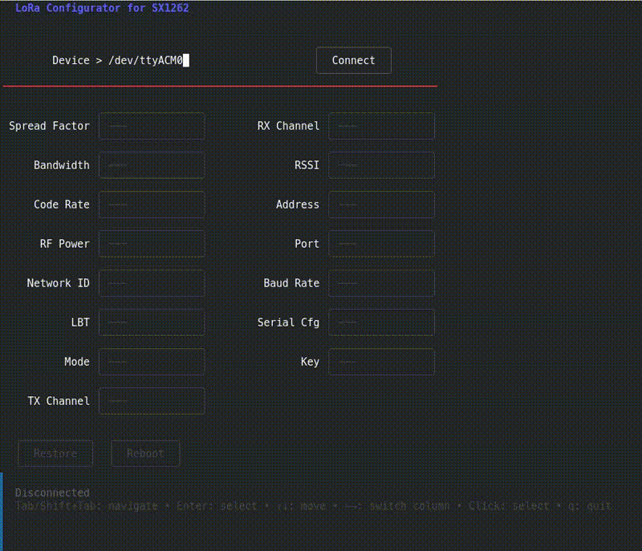

# lora-config-SX1262

TUI application for configuring [Waveshare USB-TO-LoRa-xF](https://www.waveshare.com/wiki/USB-TO-LoRa-xF) devices via AT commands.



## Features

- Connect to device over serial port (default `/dev/ttyACM0` at 115200 baud)
- Auto-read all current parameters on connect via `AT+ALLP?`
- Configure all 15 device parameters with immediate write-back
- Visual feedback: green border on success, red on error
- Factory restore and reboot commands
- Firmware version display

## Parameters

| Parameter | AT Command | Type | Range |
|-----------|-----------|------|-------|
| Spread Factor | AT+SF | dropdown | 7-12 |
| Bandwidth | AT+BW | dropdown | 125KHz, 250KHz, 500KHz |
| Code Rate | AT+CR | dropdown | 4/5, 4/6, 4/7, 4/8 |
| RF Power | AT+PWR | dropdown | 10-22 dBm |
| Mode | AT+MODE | dropdown | Stream, Packet, Relay |
| LBT | AT+LBT | dropdown | Disabled, Enabled |
| RSSI | AT+RSSI | dropdown | Disabled, Enabled |
| Baud Rate | AT+BAUD | dropdown | 1200-115200 |
| Serial Config | AT+COMM | dropdown | 8N1, 8E1, 8O1, ... |
| Network ID | AT+NETID | text input | 0-255 |
| TX Channel | AT+TXCH | text input | 0-80 |
| RX Channel | AT+RXCH | text input | 0-80 |
| Address | AT+ADDR | text input | 0-65535 |
| Port | AT+PORT | text input | 0-65535 |
| Encryption Key | AT+KEY | text input | 0-65535 |

## Build

```
go build -o lora-config-SX1262
```

## Usage

```
./lora-config-SX1262
```

### Controls

| Key | Action |
|-----|--------|
| Tab / Shift+Tab | Navigate between fields |
| Arrow Up/Down | Move within column |
| Arrow Left/Right | Switch column |
| Enter | Open dropdown / confirm input |
| Esc | Cancel / close dropdown |
| d | Disconnect |
| q | Quit |

### Workflow

1. Enter device path (e.g. `/dev/ttyACM0`)
2. Tab to Connect, press Enter
3. All fields populate with current device values
4. Navigate to a parameter, press Enter to edit
5. Select new value (dropdown) or type a number (text input), press Enter
6. Field turns green on success, red on failure

## AT Command Protocol

Each parameter change runs a full serial session:

```
+++\r\n          -> device echoes "+++"
AT+SF=8\r\n      -> device responds "OK"
AT+EXIT\r\n      -> device responds "OK"
```

Sessions are mutex-protected and sequential. A 1-second delay after each `AT+EXIT` ensures the device returns to normal mode before the next session.

## License

MIT
